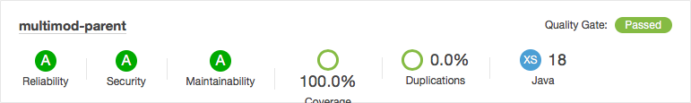

This project is created to experiment with junit tests for both *surefire* and *failsafe* plugins
in a multi module maven project. Especially we want to see how the coverage metrics end up in sonarqube.

A docker-compose file is included to start sonarqube. `docker-compose up -d` will start
sonarqube on port 9000.

Once sonarqube is running do `mvn clean verify sonar:sonar` to run tests with jacoco coverage.  
The metrics will upload to the local sonarqube: [http://localhost:9000/projects](http://localhost:9000/projects)

What we want to achieve in this project is that we can detect coverage even if we have a test
in module 3 which covers code in module 1 for example.

 Module        | Coverage
-------------- | -------------
 multimod-mod1 | 100%
 multimod-mod2 | 100%

Use case is we want to have extra coverage in module 1 since we have tests in module 3
where we test code for the first module. The we can have (integration/component/unit) tests that span multiple modules. 